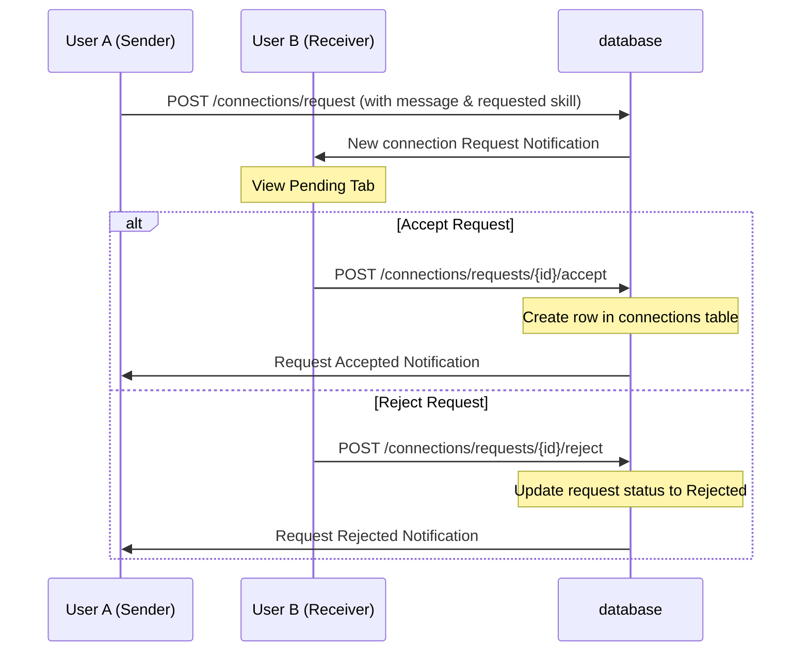

# Feature Documentation

This document describes the design, execution rules, and workflows for the key features in SkillSwap Hub.

---

## 1. Connection Invite Workflow

Connecting is the gateway to peer exchanges.

---

## 2. Real-Time Chat & Spam Prevention

To prevent message spamming, the chat system enforces a strict unread message limit:

* **3-Unread-Message limit:** Users can send a maximum of **3 unread messages** to a recipient. 
* **Input Blocking:** Once the limit is reached:
  * The frontend disables the message input and send button, displaying the notice: *"⚠️ Unread message limit reached. You can only send up to 3 unread messages before the recipient reads them."*
  * The backend validates this count. If a client attempts to bypass the UI restriction, the API rejects the request with a `400 Bad Request` block.
* **Limit Reset:** The limit immediately resets when the receiver opens the chat page, which calls `PUT /chat/conversations/{conversation_id}/read` to mark all incoming messages as read.

---

## 3. Safety Blocks Cascading Behavior

Blocking a user triggers a cascade of relationship severing to ensure immediate isolation:

* When User A blocks User B:
  1. A row is added to the `blocks` table.
  2. Any active connection request between A and B is deleted.
  3. Any active connection between A and B is deleted from the `connections` table.
  4. Active sessions and upcoming meeting coordinates are immediately revoked.
  5. Chat endpoints block message sending and history retrieval between A and B.

---

## 4. Secure Jitsi Meet Joining Rules

Jitsi Meet integration handles video conferencing securely:

* Meeting URLs are dynamically generated upon session request approval: `https://meet.jit.si/SkillSwap-{session_id}`.
* When a user clicks **Join Meeting**:
  1. The client requests the meeting link via `GET /meetings/{session_id}/join`.
  2. The backend verifies:
     * The session exists.
     * The requester is either the `requester_id` or the `receiver_id` of the session.
     * The session status is either `'Accepted'` or `'Scheduled'`.
     * No active blocks exist between the participants.
  3. If all validations pass, the endpoint returns the meeting record, and the client redirects the user to the Jitsi meeting room.
