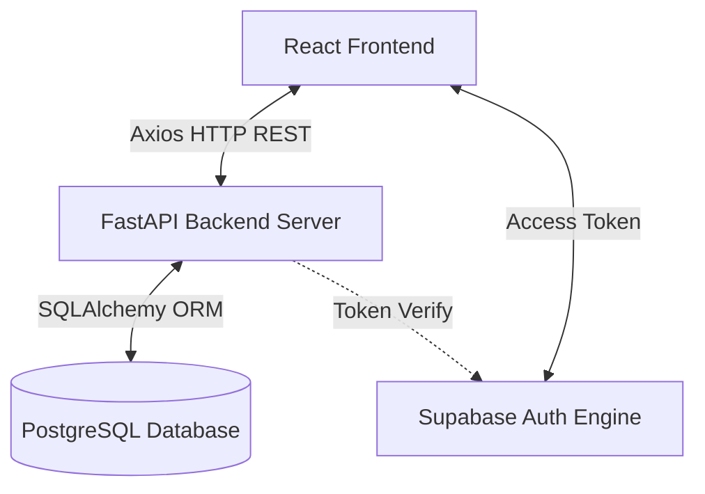

# System Architecture Documentation

This document describes the high-level architecture, tech stack, data communications layout, authentication mechanisms, and validation middlewares used in SkillSwap Hub.

---

## Technical Stack Overview

SkillSwap Hub uses a modern, separated client-server architecture:



* **Frontend:** Built with React 18 using Vite, TypeScript, and Vanilla CSS. Access and routes are protected using client-side react-router-dom route guards.
* **Backend:** Powered by FastAPI. Built on asynchronous handlers and SQLAlchemy 2.0 ORM.
* **Authentication:** Handled via Supabase JWT Auth. The client authenticates with Supabase, obtains a JSON Web Token (JWT), and sends it to the FastAPI backend via the `Authorization: Bearer <JWT>` header. The backend verifies the token and retrieves the user profile.

---

## Authentication & Session Management

When a user logs in or registers:
1. The React app requests credentials verification from Supabase.
2. Supabase returns a JWT token.
3. The React app stores the token in localStorage and updates the React Context (`AuthContext.tsx`).
4. All subsequent API queries include the token inside the HTTP headers:
   ```http
   Authorization: Bearer <access_token>
   ```
5. The FastAPI backend extracts the token using the `get_current_user` dependency, validates the signing key against Supabase settings, extracts the unique user ID, and matches it with the database record.

---

## Safety & Moderation Middleware Checks

Before execution of key peer interactions (sending messages, proposing sessions, joining meetings), the backend enforces several validation layers:

* **Active Connection validation:** Users must have an accepted row inside the `connections` table (which is established when one user accepts the other's request invitation).
* **Block validation:** If user A blocks user B, a row is created in the `blocks` table. Any connection is immediately severed, and all endpoints for chat messaging, session proposals, and meeting joining will block requests matching that pair in either direction.
* **3-Unread-Message limit:** Prevents spam. The message send endpoint queries the message logs. If the sender has $\ge 3$ unread messages sent to the receiver, the backend rejects the query with a `400 Bad Request` until the receiver marks those messages as read.
